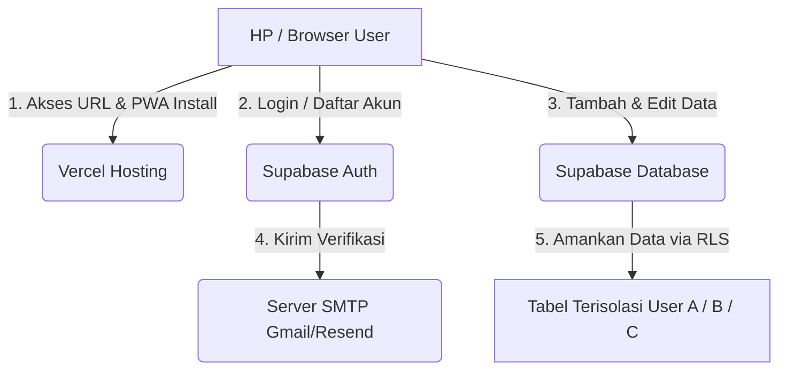

# Panduan Belajar StokPlan: Analisis Arsitektur dari Hulu ke Hilir 🎓

Buku panduan ini dibuat khusus untuk membantu Anda memahami seluruh proses di balik layar pembuatan aplikasi **StokPlan**. Dengan membaca dokumen ini, Anda tidak hanya tahu cara menginstruksikan pembuatan aplikasi, tetapi juga memahami konsep rekayasa perangkat lunak (*software engineering*) yang terjadi di belakangnya.

Dokumen ini sangat cocok untuk dimasukkan ke dalam **AI Notes** Anda sebagai bahan rangkuman pembelajaran.

---

## 🗺️ 1. Peta Arsitektur Aplikasi (Hulu ke Hilir)

Aplikasi StokPlan dirancang dengan arsitektur **Modern Fullstack Serverless**:



### Penjelasan Alur:
1. **Frontend (Hulu)**: Pengguna mengakses aplikasi web yang di-host di **Vercel** melalui HP atau komputer. Karena aplikasi memiliki fitur **PWA (Progressive Web App)**, file web akan diunduh ke penyimpanan lokal perangkat sehingga bisa diinstal di layar utama HP.
2. **Autentikasi (Gerbang Keamanan)**: Pengguna melakukan pendaftaran/login melalui **Supabase Auth**. Supabase akan mengirimkan email verifikasi otomatis menggunakan server **SMTP** Anda.
3. **Database Cloud (Hilir)**: Setiap transaksi, produk, dan kategori disimpan di **Supabase PostgreSQL**. Data ini dilindungi oleh **Row Level Security (RLS)** untuk menjamin isolasi data mutlak antar-pengguna.

---

## 🎨 2. Bagian Frontend: React + TypeScript + Vite

Frontend bertugas sebagai antarmuka visual yang berinteraksi langsung dengan pengguna.

### A. Pengelola Data Terpusat: `StokContext.tsx`
Dalam React, data sering kali harus digunakan oleh banyak halaman. Alih-alih mengoper data secara manual ke setiap halaman, kita menggunakan **React Context** sebagai "mesin data tunggal" di belakang layar.
* **Hybrid Mode (Sinkronisasi Otomatis)**: Di dalam `StokContext.tsx`, terdapat pengecekan otomatis. Jika kredensial Supabase ada di file `.env.local`, data akan diarahkan langsung ke cloud. Jika tidak ada, sistem secara cerdas menyimulasikannya menggunakan `localStorage` di memori browser Anda agar aplikasi tetap bisa dicoba (Mode Demo).
* **Penyaring User ID**: Di mode lokal, sistem menyaring produk berdasarkan ID pengguna yang masuk:
  ```typescript
  const userProducts = allProducts.filter(p => p.user_id === user.id);
  ```

### B. Pengatur Rute: `App.tsx`
`App.tsx` bertugas sebagai polisi lalu lintas yang menentukan halaman mana yang tampil di browser berdasarkan alamat URL (misal: `/login`, `/dashboard`, `/barang`).
* **Auth Guard (Pelindung Rute)**: Sistem akan membaca apakah status `user` sudah login. Jika belum, halaman apa pun yang diakses akan dipaksa redirect kembali ke `/login`.
* **Deteksi Rute Dinamis**: Kita menyembunyikan bilah navigasi bawah (*bottom navigation*) secara dinamis pada halaman formulir input (seperti tambah barang `/barang/baru`) agar layout tidak terpotong oleh keyboard seluler.

### C. Halaman Utama & Logikanya
* **Dashboard.tsx**: Menghitung keuangan secara real-time.
  * *Total Modal* didapat dari rumus matematika: \(\sum (Stok \times Harga Modal)\) untuk semua produk aktif.
  * *Total Omset* didapat dari rumus: \(\sum (Jumlah \times Harga Jual)\) untuk semua transaksi berjenis `keluar`.
* **Barang.tsx**: Mengatur folder kategori. Jika sebuah kategori dihapus, database diinstruksikan untuk menggunakan aturan `ON DELETE SET NULL`, yang berarti barang-barang di dalam kategori tersebut tidak akan ikut terhapus, melainkan dipindahkan ke folder umum *"Tanpa Kategori"*.

---

## 🗄️ 3. Bagian Database & Keamanan: Supabase Cloud

Supabase menyediakan database relasional **PostgreSQL** yang andal di cloud.

### A. Skema Tabel Relasional
Database StokPlan menggunakan 3 tabel utama yang saling terhubung:
1. **`categories` (Kategori)**: Menyimpan nama folder kategori yang dibuat pengguna.
2. **`products` (Produk)**: Menyimpan data barang (Nama, Harga Modal, Harga Jual, Stok). Tabel ini memiliki kolom `category_id` yang merujuk pada tabel kategori.
3. **`stock_transactions` (Transaksi)**: Mencatat riwayat mutasi barang masuk atau keluar. Tabel ini terhubung ke `products` melalui `product_id`.

Setiap tabel memiliki kolom **`user_id`** untuk mencatat siapa pemilik data tersebut.

### B. Row Level Security (RLS) - Kunci Privasi Data
Ini adalah konsep keamanan terpenting. Tanpa RLS, siapa saja yang memiliki link aplikasi bisa membaca data milik orang lain. 
Saat RLS diaktifkan, kita menulis aturan (*policy*) di database:
```sql
CREATE POLICY "Users can manage their own products" ON products
    FOR ALL USING (auth.uid() = user_id);
```
* **Cara Kerjanya**: Setiap kali aplikasi meminta data barang (`SELECT * FROM products`), database Supabase akan memeriksa siapa token pengguna yang sedang login (`auth.uid()`). Database hanya akan mengembalikan baris data yang nilai kolom `user_id`-nya sama dengan ID pengguna tersebut. Akun lain tidak akan mendapatkannya.

### C. SQL Stored Procedure: `adjust_stock`
Di database, kita membuat fungsi khusus bernama `adjust_stock`. Ketika pengguna melakukan mutasi stok di HP:
1. Frontend memicu fungsi `adjust_stock` di database.
2. Database secara otomatis mengupdate stok produk (mengurangi atau menambah).
3. Di saat yang bersamaan, database mencatat log ke tabel `stock_transactions`.
* **Mengapa di database, bukan di frontend?** Ini dinamakan transaksi **atomik**. Jika koneksi internet terputus di tengah jalan saat mengupdate stok, pencatatan transaksi juga akan dibatalkan secara otomatis (Rollback). Ini mencegah terjadinya selisih data (stok berkurang tetapi transaksi tidak tercatat).

---

## 📱 4. Kemampuan Mobile: PWA & Service Worker

Agar web bisa diunduh di HP layaknya aplikasi toko aplikasi native, kita mengaktifkan fitur **PWA (Progressive Web App)**:

1. **`manifest.json` (Identitas Aplikasi)**:
   Mendefinisikan nama aplikasi, warna tema layar, dan menunjuk ke file ikon (`icon-192.png` dan `icon-512.png`) yang akan tampil di layar utama HP. Pengaturan `"display": "standalone"` memastikan browser menyembunyikan kolom alamat URL ketika aplikasi dibuka.
2. **`sw.js` (Service Worker - Asisten Latar Belakang)**:
   Skrip Javascript yang berjalan di latar belakang browser HP. Kita menggunakan strategi **Network-First, Cache-Fallback**:
   * Saat HP terhubung internet, aplikasi akan selalu mengambil data terbaru dari server (*Network-First*).
   * Namun, file web (HTML, CSS, JS) juga disimpan di memori HP. Jika Anda sedang berada di daerah susah sinyal (*Offline*), Service Worker akan langsung menyajikan file cadangan tersebut (*Cache-Fallback*), sehingga aplikasi tetap terbuka instan dan tidak menampilkan halaman error *"No Internet Connection"*.

---

## 🚀 5. Alur Deployment: CI/CD (GitHub + Vercel)

* **GitHub** bertugas sebagai repositori pengontrol versi. Ketika kita menjalankan perintah `git push` di terminal, kode di komputer kita dikirim ke GitHub.
* **Vercel** bertugas sebagai server hosting. Vercel terhubung ke repositori GitHub Anda.
* **Proses Otomatis (CI/CD)**: Setiap kali ada kode baru yang masuk ke branch `main` di GitHub, Vercel akan langsung mendeteksi, melakukan kompilasi (*build*) ulang otomatis, dan memperbarui website publik Anda dalam hitungan detik secara otomatis tanpa perlu mematikan website utama (*Zero Downtime*).

---

## 🛠️ 6. Studi Kasus Pemecahan Masalah (Troubleshooting)

Sebagai bahan pembelajaran, berikut adalah kendala yang sempat kita temukan dan bagaimana cara mengatasinya secara logis:

### Kasus A: Error `Could not find the 'user_id' column`
* **Gejala**: Aplikasi error saat menambah barang, dan data pengguna baru bocor/sama dengan pengguna pertama.
* **Penyebab**: Tabel lama di Supabase masih menggunakan skema awal yang tidak memiliki kolom `user_id`. Karena tabel lama belum dihapus, skema baru dilewati saat menjalankan SQL script.
* **Solusi**: Kita menambahkan perintah `DROP TABLE ... CASCADE` di awal skema SQL untuk menghapus tabel lama beserta keterkaitan relasinya secara total, kemudian membuat ulang tabel baru yang lengkap dengan RLS dan kolom `user_id`.

### Kasus B: Keyboard HP Menutupi Tombol Selesai
* **Gejala**: Di HP, tombol "Simpan" pada modal kategori terdorong ke bawah keyboard virtual dan tidak bisa di-scroll.
* **Penyebab**: Modal didesain menempel di bagian bawah (*bottom-drawer*). Saat keyboard aktif, tinggi layar menyusut dan menekan paksa modal tersebut.
* **Solusi**: Modal diubah menjadi **Centered Dialog** (melayang di tengah layar). Browser secara otomatis memusatkan elemen yang sedang aktif di sisa ruang viewport, sehingga seluruh form tetap terlihat di atas keyboard.

### Kasus C: Batasan Email (Rate Limit Exceeded)
* **Gejala**: Muncul pesan limit saat mendaftarkan akun baru berturut-turut.
* **Penyebab**: Server SMTP gratisan bawaan Supabase dibatasi hanya boleh mengirim 3 email per jam.
* **Solusi**: Kita menghubungkan server SMTP eksternal (seperti Gmail SMTP dengan Sandi Aplikasi khusus) ke dalam konfigurasi autentikasi Supabase. Hal ini memindahkan jalur pengiriman email dari server Supabase ke server Google, meningkatkan batas pengiriman hingga 500 email per hari secara gratis.
