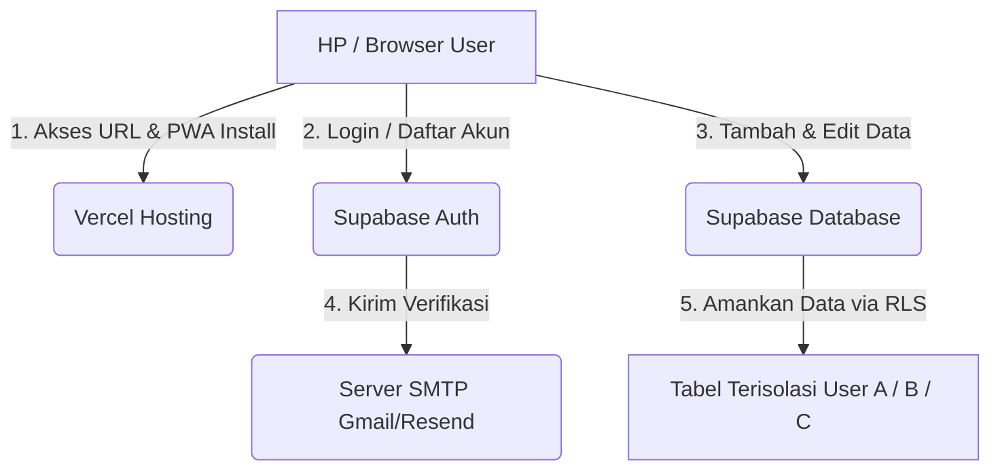

# Rangkuman Keputusan Arsitektur & Rekayasa StokPlan 🧠

Buku panduan ini mendokumentasikan keputusan arsitektur, pilihan teknologi, trade-off, penyelesaian bug, dan praktik terbaik rekayasa perangkat lunak (*software engineering*) yang diterapkan pada aplikasi **StokPlan**. 

Gunakan file ini untuk dipelajari secara mandiri atau masukkan ke dalam **AI Notes** Anda untuk membantu merangkum alur pembuatan aplikasi dari awal hingga go-live.

---

## 🗺️ 1. PETA ARSITEKTUR UTAMA (HULU KE HILIR)

### Penjelasan Alur Data:
1. **Frontend (Hulu)**: Pengguna mengakses web aplikasi di browser HP/Laptop. Web di-host di server global **Vercel** yang sangat cepat.
2. **Koneksi Cloud (Middle)**: Frontend menggunakan pustaka `@supabase/supabase-js` untuk melakukan panggilan API langsung ke **Supabase** secara asinkron (*asynchronous*).
3. **Database & Security (Hilir)**: Supabase PostgreSQL memproses data. Di sini data disaring secara ketat oleh **Row Level Security (RLS)** sebelum disimpan ke penyimpanan cakram cloud.

---

## 🏗️ 2. MENGAPA LANGKAH INI DIPILIH & KENAPA BUKAN LANGKAH LAIN?

Setiap baris kode dan teknologi yang dipilih memiliki alasan dan alternatifnya. Berikut adalah analisis keputusan arsitekturnya:

### A. Database: Supabase (PostgreSQL) vs Firebase (NoSQL/Firestore)
* **Keputusan**: Memilih **Supabase (PostgreSQL)**.
* **Alasan**: Data inventaris dan transaksi keuangan bersifat **relasional** (saling berhubungan) dan membutuhkan **konsistensi yang ketat**. PostgreSQL menjamin bahwa:
  * Harga modal dan harga jual harus selalu bernilai positif (`CHECK > 0`).
  * Stok barang tidak boleh bernilai negatif (`CHECK >= 0`).
  * Penghapusan kategori otomatis memindahkan barang terkait ke kategori umum menggunakan aturan `ON DELETE SET NULL`.
* **Kenapa bukan Firebase?**
  Firebase Firestore adalah database *NoSQL* berbentuk dokumen. Di NoSQL, tidak ada relasi tabel bawaan. Jika Anda menghapus kategori, Anda harus menulis kode manual di sisi klien (HP) untuk mencari semua produk terkait dan mengupdate kategorinya satu per satu. Jika internet terputus di tengah proses, database akan menjadi tidak konsisten (menyisakan referensi kategori sampah).

### B. Keamanan: Row Level Security (RLS) vs Filter Sisi Klien (Frontend Filter)
* **Keputusan**: Mengaktifkan **Row Level Security (RLS)** pada tingkat tabel Supabase.
* **Alasan**: RLS bertindak sebagai gerbang keamanan mutlak di tingkat database. Database hanya akan mengembalikan data jika ID pengguna yang sedang login (`auth.uid()`) cocok dengan kolom `user_id` di baris data tersebut.
* **Kenapa bukan filter sisi klien?**
  Jika kita menyaring data di frontend (mengunduh semua data produk semua pengguna ke HP, lalu menyaringnya di React menggunakan `.filter(user_id)`), ini adalah **kebocoran keamanan fatal**. Siapa pun yang mengerti cara membuka *Console DevTools* di browser dapat melihat data stok, harga, dan rahasia dagang toko milik orang lain.

### C. Teknologi Bahasa: TypeScript vs JavaScript Biasa
* **Keputusan**: Menggunakan **TypeScript (.tsx / .ts)** dalam ekosistem React.
* **Alasan**: TypeScript memaksa pendefinisian tipe data secara ketat sejak awal (misalnya, memastikan variabel `harga` selalu bertipe `number`, bukan `string`). Ini mencegah bug umum seperti kesalahan penjumlahan string (contoh: `1000 + 500` menjadi `"1000500"` di JavaScript, yang berakibat fatal pada kalkulasi keuangan toko).
* **Kenapa bukan JavaScript?**
  JavaScript biasa sangat longgar. Kesalahan ketik nama variabel baru terdeteksi saat web dijalankan oleh pengguna, sedangkan di TypeScript kesalahan ketik langsung memicu error saat proses kompilasi (*build time*) sebelum web dideploy.

### D. Platform Aplikasi: PWA (Progressive Web App) vs Aplikasi HP Native (Flutter / Android Studio)
* **Keputusan**: Mengonversi web menjadi **PWA (Progressive Web App)** standar penuh.
* **Alasan**:
  * **Biaya Penghematan**: Tidak perlu membayar akun pengembang Google Play ($25) atau Apple Developer ($99/tahun).
  * **Kemudahan Akses**: Pengguna cukup membuka link di browser HP dan menekan "Instal ke Layar Utama".
  * **Auto-Update**: Setiap kali kode di-push ke GitHub, aplikasi di HP pengguna akan langsung terupdate otomatis tanpa harus melakukan instal ulang.
* **Kenapa bukan Aplikasi HP Native?**
  Membuat aplikasi dengan Flutter/React Native membutuhkan dua pangkalan kode (*codebase*) terpisah yang rumit, waktu kompilasi yang lama, dan harus melalui proses tinjauan manual oleh Google/Apple yang memakan waktu berhari-hari.

---

## 🛠️ 3. PELAJARAN DARI KASUS BUG & SOLUSINYA

Berikut adalah kendala dunia nyata yang terjadi selama pembuatan StokPlan dan bagaimana kita menyelesaikannya:

### Kasus 1: Error `Could not find the 'user_id' column`
* **Sebab**: Ketika kita menumpuk tabel baru di atas database yang sudah ada, PostgreSQL melewati pembuatan tabel karena nama tabelnya sudah ada. Kolom baru `user_id` pun tidak pernah terbentuk.
* **Solusi**: Kita menambahkan instruksi `DROP TABLE ... CASCADE` sebelum perintah `CREATE TABLE`. Perintah `CASCADE` secara paksa menghapus tabel lama beserta semua batasan relasinya (*foreign keys*), sehingga tabel baru yang bersih dengan kolom `user_id` dan kebijakan RLS dapat terbuat dengan sempurna.

### Kasus 2: Tombol Formulir Terpotong Keyboard Virtual di HP
* **Sebab**: Modal input kategori awalnya menggunakan gaya *bottom-drawer* (menempel di bawah). Ketika keyboard HP muncul, tinggi viewport browser menyusut tajam dan memotong tombol bagian bawah modal.
* **Solusi**: Kita mengubah modal menjadi **Centered Dialog** (melayang di tengah layar). Perilaku alami browser seluler adalah menjaga elemen yang sedang terfokus (kolom input) dan modalnya melayang secara proporsional di sisa area layar yang tidak tertutup keyboard.

### Kasus 3: Limit Email Verifikasi (Rate Limit Exceeded)
* **Sebab**: Supabase membatasi pengiriman email verifikasi pendaftaran maksimal hanya 3 email per jam pada server SMTP gratisan mereka untuk menghindari penyalahgunaan spam.
* **Solusi**: Kita menghubungkan **SMTP Eksternal** (seperti Gmail SMTP dengan Sandi Aplikasi khusus) ke dalam setelan Supabase. Hal ini mengalihkan tugas pengiriman email ke server raksasa milik Google yang memiliki limit gratis hingga 500 email per hari.

---

## 💡 4. PETUNJUK MASA DEPAN: CARA MEMBERIKAN PROMPT YG DETAIL

Agar di proyek berikutnya Anda dapat mengarahkan AI coder untuk bekerja dengan sangat presisi dan cepat, gunakan panduan menulis perintah (*prompting*) berikut:

| Kategori Kebutuhan | Contoh Perintah yang Buruk ❌ | Contoh Perintah yang Sangat Baik (Detail)  |
| :--- | :--- | :--- |
| **Keamanan Akun** | "Buat fitur login." | "Buat sistem registrasi dan login multi-user menggunakan Supabase Auth. Pastikan data antar-pengguna diisolasi secara ketat menggunakan Row Level Security (RLS) di tingkat database." |
| **Relasi Hapus Data** | "Buat kategori barang." | "Jika kategori dihapus, produk di dalamnya jangan ikut terhapus, melainkan ubah nilai `category_id` produk tersebut menjadi `NULL` (Umum). Namun, jika produk dihapus, hapus juga semua log transaksinya (`CASCADE`)." |
| **Optimasi Seluler** | "Bikin tampilannya ramah HP." | "Aplikasi ini akan diinstal di layar utama HP menggunakan PWA. Sembunyikan navigasi bawah (*bottom-nav*) ketika pengguna sedang membuka halaman input/formulir agar tidak terpotong oleh keyboard HP." |
| **Kalkulasi Keuangan** | "Hitung total modal barang." | "Hitung total modal secara real-time di sisi klien menggunakan penjumlahan agregat hasil kali antara `stok` dan `harga_modal` untuk setiap produk aktif." |
| **Mode Luring (Offline)** | "Buat aplikasi cloud." | "Gunakan arsitektur hybrid. Jika kredensial cloud tidak terdeteksi, aplikasi harus otomatis beralih ke Mode Demo menggunakan simulasi `localStorage` agar fungsionalitas utama tetap dapat diuji offline." |
